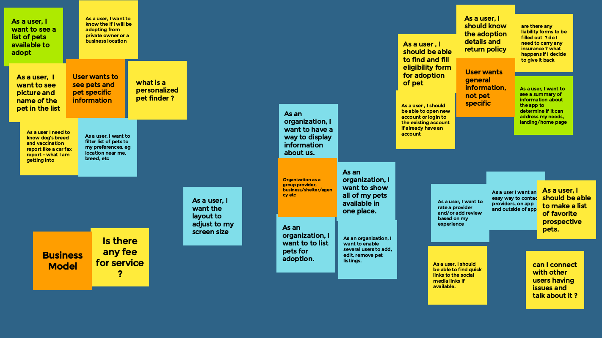
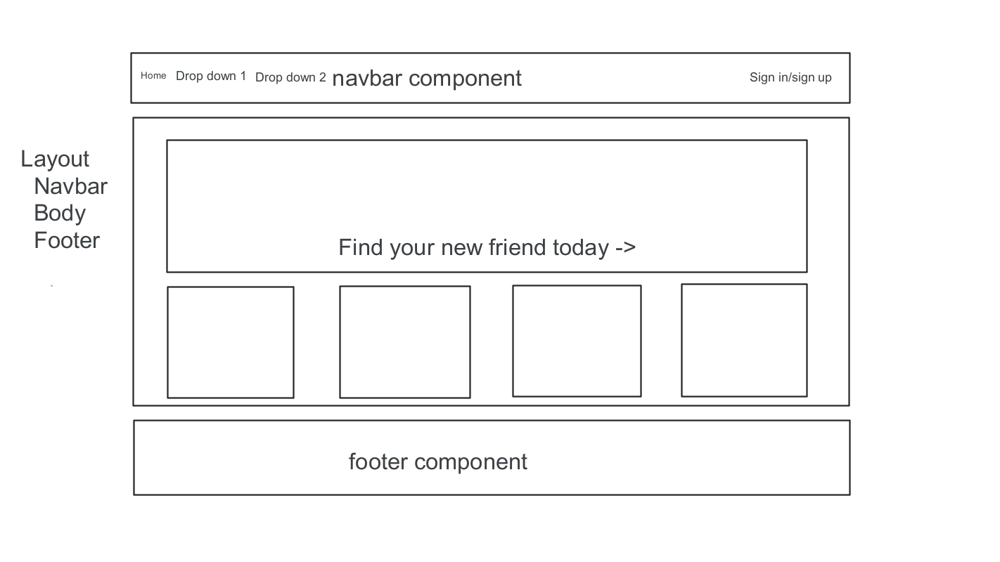
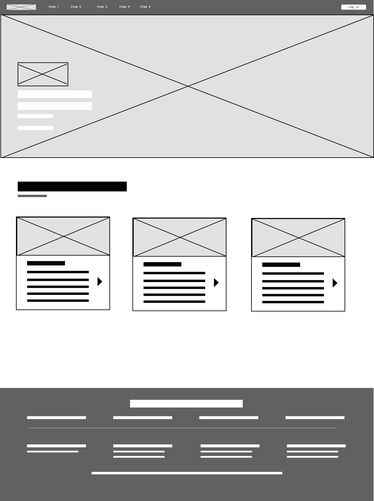
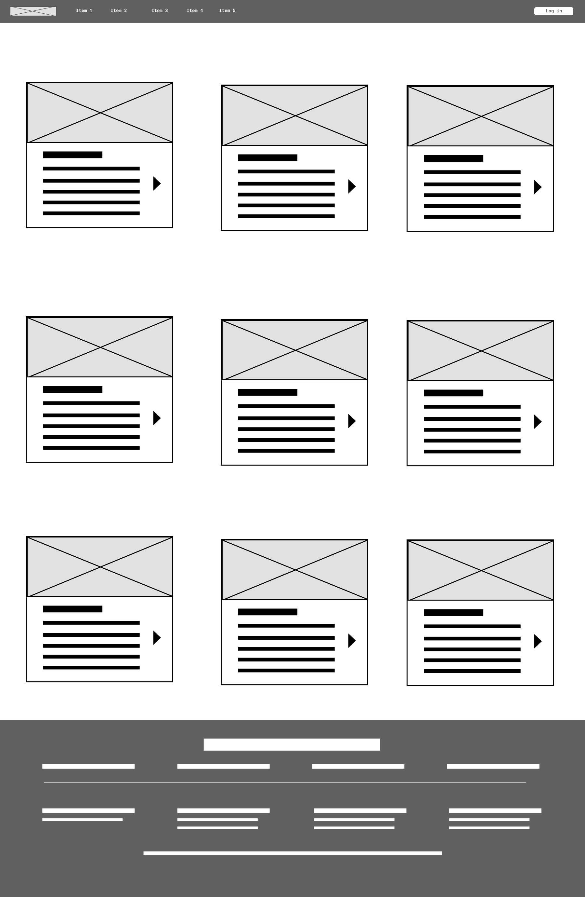
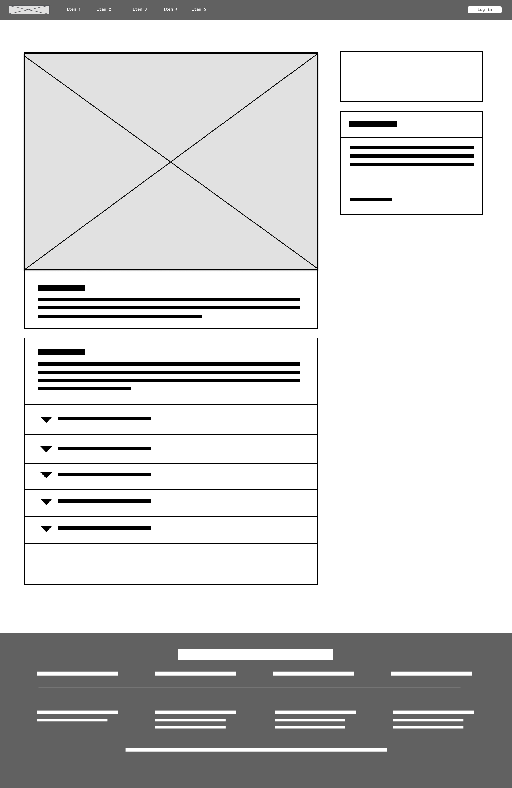

# Adopt-a-Friend Backend

[Adopt a Friend](https://well-fed-devs.herokuapp.com/), a friendly dog adoption app to help you locate your next best friend. This backend provides the api, enabled by Petfinder, and serves the static files built in the [Frontend](https://github.com/Adoptafriend/Frontend).

> _Find your new friend today!_

 

## Team

### The Well-Fed-Devs Quad Pod

- Anuja Surawashi
- Mark Warner
- Muneer Malik
- Preeti Das
    

## Tech Stack

### Backend

- Express
- Petfinder API
- Axios
- Heroku
- Jest
- Nodemon
- Dotenv
- ESLint & Prettier

### Frontend

- React
- Chakra-ui
- Jest
- ESLint & Prettier

 

## User Stories

  

## Wireframes

### Layout

  

### Home

  

### Gridwall

  

### Pet Display Page

  
